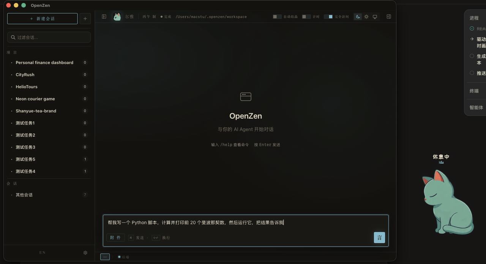
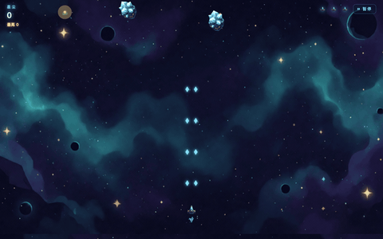
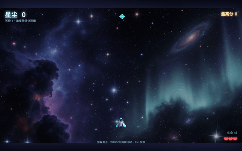
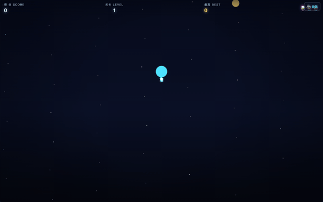
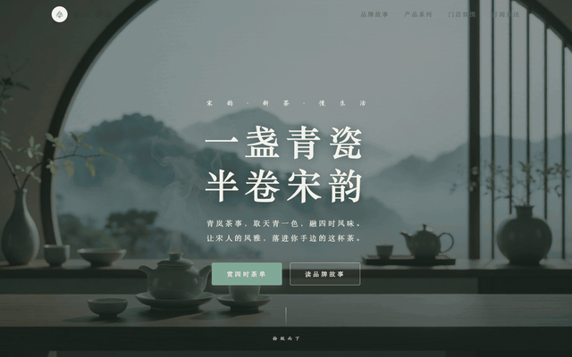
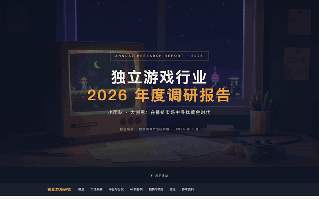
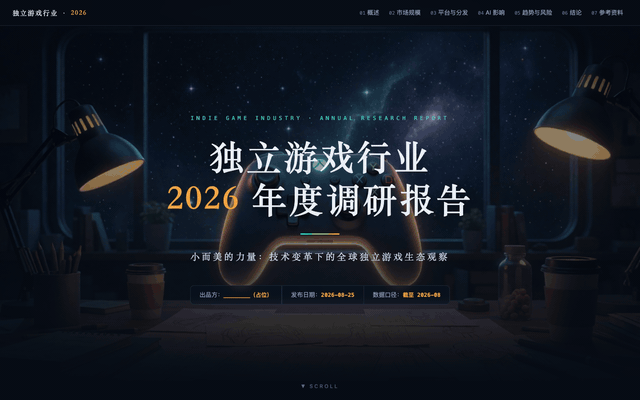
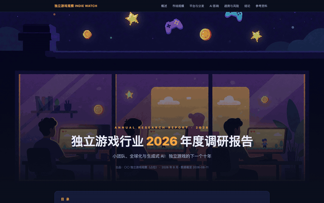

# OpenZen

> **A cat that remembers you**
> A fully-local autonomous agent harness built for Apple Silicon unified memory — local inference (oMLX) + local memory (ERME) + a Ru-ware celadon desktop.


**English** · [中文](README.zh-CN.md)

---

## Why OpenZen

A Mac Studio M3 Ultra has **256GB of unified memory** — the wall between VRAM and RAM disappears. Fitting a large model used to mean budgeting a 8–48GB card; unified memory lets **model weights, vector indexes, browsers and toolchains live in one pool**.

OpenZen is designed for that machine: a **fully local** autonomous agent harness —

- **Local inference**: the oMLX inference server (MLX framework, OpenAI-compatible `/v1` API on `127.0.0.1:8000`) keeps multiple long-context models resident (e.g. 256K-context MXFP4 quantized models);
- **Local memory**: the in-house ERME entropy-reduced memory engine lives entirely under `~/.openzen/` — data never leaves the machine;
- **Local cache dividend**: prompt cache hit rate is about **96%** on typical sessions and climbs to **98%** on long-running tasks (>2h) — measured 98.05% on a 6.3-hour, 38.1M-token benchmark run. For a locally deployed model, cache hit rate measures not token cost — local cache is free — but **prefill speed**: the higher the hit rate, the fewer tokens genuinely need re-prefilling per request, dramatically accelerating prefill and therefore response speed, which keeps long local sessions responsive.

It's also a **7×24 resident companion**: interrupted sessions resume from checkpoints, and every delivery — success or failure — is remembered and turned into experience for the next task. That's the compounding a session-based harness cannot do.

> Current form: macOS Apple Silicon desktop app (Tauri). TUI and WebUI have been removed from the product surface; the desktop experience is the focus.

---

## Features

### 1. Fully local: zero-cloud inference & memory

oMLX inference + ERME memory + all data (`workspace/`, `memory_erme/`, `harness/`, `logs/`) live on your machine. 25 configurable model slots (local oMLX primary, cloud APIs optional). Works offline.

### 2. ERME — entropy-reduced memory engine (in-house)

A layered engine for long-term personal memory, built on the philosophy of **entropy reduction** — a hot cache layer, a semantic vector layer, and a compressed persistent layer:

| Layer | Recall latency | Key implementation |
|---|---|---|
| **L0 Soul layer** | nanosecond (resident in memory) | Portrait, LifeNarrative, ReflectionEngine, RamblingEngine |
| **L1 Working cache** | nanosecond (resident in memory) | Concurrent hashmap + Moka + AttentionLRU + WAL crash recovery |
| **L2 Vector index** | microsecond (resident in memory) | HNSW (384-dim) + MLX embeddings (pure-Rust fallback without MLX) |
| **L3 Persistence** | millisecond | Budget control (daily token cap + importance-scored per-item eviction) |

Deeply optimized for the Mac Studio M3 Ultra's 256GB unified memory: L0/L1/L2 live fully resident in RAM, recalling at nanosecond / nanosecond / microsecond levels. With 256K tokens of new memory per day, a year of memory occupies only ~**100MB** locally — the budget controller guarantees it never grows unbounded. Plus conflict resolution (supplement / sublimate / overturn), a quarantine zone (bad conjectures never pollute memory) and reality anchoring. 221 tests.

### 3. Memory compounding — what session-based harnesses can't do

- **Checkpoint resume**: MmapWal + loop checkpoints resume mid-session after process restarts; checkpoints carry git snapshots (sha / branch / origin);
- **Harness refine** (mechanism borrowed from Prime Agent): the model **proactively writes reusable lessons into an audited ledger** (`harness_state.json`) — writes require verifiable evidence, with snapshot rollback; each session injects `## Persistent Harness Lessons` ranked by Jaccard relevance;
- **Reflection loop**: successes and failures settle into `reflections.jsonl`, readable by future sessions.

### 4. Delivery quality gates (QA–QE)

Turning "delivery quality" from an intention into a measurable, regression-tested engineering system:

- **Acceptance assertions**: tasks first create a `task_spec.md` with real executable `[verify]` commands, enforced before exit (minimal assertions auto-synthesized when no spec exists);
- **Independent review**: a clean-context review (spec + deliverables + reply), preferably with a different model / temperature=0 to escape self-review blind spots;
- **Diff self-check**: a final pass of the whole diff against the spec, file by file;
- **Delivery contract**: a mandatory three-part report — what was done / how it was verified / what was left;
- **Post-write verification chains**: auto-runs the lightweight check for the project type (`cargo check` / `tsc` / `py_compile` / `go vet` …);
- **Ledger feedback**: quality failures become ledger entries that future sessions automatically avoid.

### 5. Artifact-grammar UI: a piece of Ru-ware celadon

The desktop is not a "software panel" — it's a **Ru-ware porcelain**: the "sky-clearing-after-rain" celadon aesthetic translated into an interface language.

- **Three-color restraint**: glaze-white (surface), celadon (the only functional color), ink (text); the sole exception is cinnabar (seals and errors);
- **Glaze as interface**: messages are carvings on the glaze, tool calls are underglaze patterns — no cards, no glassmorphism;
- **Cultural anchors**: Song-serif epigraphy + Kai-style handwriting (thinking blocks), "Zen"/"Speak" seals, stems-and-branches dating ("Bingwu year, made"), colophon signing ("Xiuyan, inscribed");
- **Complexity contract**: everything beautiful is O(1) — tiled textures decoded once on GPU, timeline folding that never mounts DOM, animations that only touch the compositor (10h soak target: RSS ≤ 350MB).

### 6. Efficiency discipline

- System prompt ~4.4KB (~1.1k tokens) vs Claude Code's 20k–43k tokens;
- Local prompt cache ~96% typical, 98% on long tasks (see Bench);
- Session distillation **fully async** (job queue + leases + crash takeover), never blocking the agent loop;
- Parallel tool execution; linkme distributed slices for zero-copy tool registration (20+ built-in tools + MCP bridge);
- Frontend streaming rendering is O(1) (timeline folding + virtual scrolling + compositor-only animations; the DOM stays constant across long sessions) — which is why peak RSS stays low (180–240MB) and responses stay snappy, a real fit for locally deployed models.

### 7. Lightweight

| Metric | Value |
|---|---|
| Single binary | 29MB |
| Installer (dmg, arm64) | 18.1MB |
| Idle memory | ~180MB (desktop main process, measured) |
| Peak memory in bench | 180–240MB RSS |
| Tests | 600+ workspace + 221 ERME |

### 8. Desktop experience

Tauri (Rust + Svelte 5): SSE streaming, `ask_user` confirmation dialogs, sidebar + right panel, settings panel (models / skills / MCP / **soul status** / token stats), auto-update. Long tasks don't cause progress anxiety — the timeline folds itself into a scroll.

### 9. Ah-Qing: the soul made visible

OpenZen's agent is named **Ah-Qing by default** (users may rename it anytime). There's also a desktop kitten of the same name — a six-state animation prototype (`idle / working / thinking / waiting / error / done`), with the animation assets produced by a **locally deployed ComfyUI + MiniMax H3 (MLX build)**. Its "mood" comes from the ERME soul layer (`get_memory_status`) — "unity of knowing and doing" made visible.

> Current stage: six-state animation prototype and a soul-visibility experiment; full desktop interactions are still being polished.

### 10. Messaging platform access: WeChat / Feishu / Telegram

The same agent kernel also connects to **WeChat, Feishu (Lark) and Telegram** via the `oz-platform-*` bridge crates — the companion on your desktop also keeps watch in the places you chat every day; 7×24 residency goes beyond the desktop.

---

## Runtime demo

A real runtime capture (local model **DeepSeek-V4-Flash-0731 · locally deployed**; task: write and run a script printing the first 20 Fibonacci numbers; the ~2.5-minute run compressed into a 7-second loop):



You can see: the **thinking blocks** in Kai-style handwriting, **tool calls** as underglaze patterns (one write initially rejected, then auto-relocated and succeeded), tokens **streaming into the glaze**, the 2/2 checklist closing out, the 📋 **delivery contract**, and **Ah-Qing** in the bottom-right corner changing states — settling back into its "done" form when the task finishes.

---

## Design Philosophy

### Functional design

The agent loop is a state machine grown in Rust: explicit `exit_reason` accounting (stopped / paused / llm_error / EXITED), exponential-backoff retry for consecutive LLM errors (local-inference stall protection), `ask_user` wait slots, **Breaker loop detection** (catches tool-call dead loops), and checkpoint resume. "Plan before acting": tasks first create a `task_spec.md` + checklist, and acceptance assertions are executed for real — **the environment is the truth, not the model's self-report**.

### Visual design

Artifact Grammar is a design *spec*, not a skin: three-color tokens, three glaze layers of tiled texture, "entering-the-glaze" easing (`cubic-bezier(.22,1,.36,1)`, 350–600ms), vertical headers, scroll-shaped narrative flow. The forbidden list is equally explicit: no cards, no glassmorphism, no full-page Canvas, no animated layout properties.

### Efficiency & lightness

Token economics + constant-cost rendering. System prompt held at ~4.4KB; skills/SOPs progressively disclosed; compression thresholds and summary-waiting policies tuned; frontend streaming rendering stays O(1) (timeline folding + virtual scrolling + compositor-only animations, constant DOM in long sessions) — the key to low peak RSS and fast responses with locally deployed models; memory bounded by budget controllers, UI bounded by the complexity contract.

### Delivery quality

Quality is a loop, not a checkpoint: failure → reflection log → ledger lesson → avoided next time. **Delivery quality is a compounding curve, not a single task's pass/fail** — the unique asset of a 7×24 resident companion.

### Soul

**Unity of knowing and doing** (from Wang Yangming's School of Mind): memory and behavior stay consistent; reflection drives evolution. The L0 soul layer evolves continuously (portrait → preference trajectory → idle association → quarantine → evolution), aiming at "understanding you better over time".

**Honest limits** (the "three buckets of cold water" written into the design):

1. The "soul layer" is a state machine plus text generation, not consciousness;
2. The "magic chemistry" is an **emergent** product of memory density × interaction count × model capability — not a deliverable. Persisting past three months of use is a precondition for the vision;
3. The value model **suggests, never decides** — progressing very cautiously.

---

## Quick Start

> Current distribution: one-click dmg from GitHub Releases. No compilation needed.

**System requirements**

- macOS on Apple Silicon (arm64)
- 64GB+ RAM recommended; 256GB unified memory (M3 Ultra) is the design target
- [oMLX](https://github.com/) local inference server (step 3)

**Install**

1. Download `OpenZen-vX.Y.Z-aarch64.dmg` from **GitHub Releases** (built automatically by CI for every version tag);
2. Drag into Applications, launch OpenZen;
3. Install and start the oMLX inference server, load a model (256K-context MXFP4 quantized models recommended — e.g. MLX builds of Qwen3.8-Flash-Next / DeepSeek-V4-Flash-0731);
4. In the OpenZen **settings panel → models**, select local oMLX (defaults to `http://127.0.0.1:8000/v1`);
5. Start a new session and talk.

**Data & privacy**: everything stays on your machine under `~/.openzen/` (`workspace/`, `memory_erme/`, `harness/`, `logs/`). No accounts, no telemetry.

---

## Comparison with Existing Harnesses

> Focusing on the harness (scaffolding) layer, not model capability. Sourced from public docs and community practice (2026-08).

| Dimension | **OpenZen** | ZCode | Hermes (Nous) | Claude Code |
|---|---|---|---|---|
| Positioning | 7×24 local resident companion | Goal-mode IDE | Minimal self-improving CLI | Industry reference |
| Runtime | **Local by default** (oMLX + ERME), data never leaves the machine | Local / cloud | Local / cloud | Cloud API |
| System prompt | ~4.4KB (~1.1k tokens) | — | Byte-stable (cache-sacred) | 20k–43k tokens |
| Memory | ERME 3 layers + L0 soul layer | Yes | SessionDB (SQLite FTS5) | CLAUDE.md ×4 + MEMORY.md |
| Memory compounding | Ledger injection + reflection + async distillation | None | Post-task auto skill crystallization | None (manual) |
| Delivery quality | Assertions / independent review / diff self-check / delivery contract | submit_plan + checklist | No system | No explicit mechanism |
| Checkpoint resume | MmapWal + git snapshot + crash recovery | None | None | In-session compact |
| Loop protection | Breaker loop detection | None | None | None |
| Desktop | Tauri artifact-grammar UI + Ah-Qing | IDE | — | — |
| Weight | 29MB binary / ~180MB idle RSS | IDE-class | Python-based | Heavy |

In one line: ZCode and Hermes also support local models and both have memory — **OpenZen's difference is turning memory into an evolving compounding loop (lessons ledger + reflection + async distillation) and turning delivery quality into a regression-tested engineering system** — the line between a companion and a tool.

---

## Comparison with Existing Memory Engines

**ERME (in-house)** — three layers plus a soul, deeply optimized for M3 Ultra unified memory: L1 working cache (nanosecond; WAL crash recovery) → L2 vector index (microsecond; HNSW semantic recall, MLX-accelerated embeddings / pure-Rust fallback) → L3 persistence (millisecond; budget control: daily token cap + importance-scored per-item forgetting); L0 soul layer (portrait / life narrative / reflection / idle rambling / quarantine evolution), also memory-resident at the nanosecond level. At 256K tokens of new memory per day, a year occupies only ~100MB. Three-state conflict resolution (supplement / sublimate / overturn), a quarantine zone ensuring bad conjectures never pollute memory. 221 tests, pure Rust, no external services.

| Alternative | Mechanism | Difference |
|---|---|---|
| **Claude Code** | 4-layer manual CLAUDE.md + auto MEMORY.md | No semantic search; section injection only |
| **Hermes SessionDB** | SQLite FTS5 (incl. CJK trigram) + LLM summaries | Full-text only, no vectors; no budgets / forgetting |
| **Gemini CLI** | `~/.gemini/GEMINI.md` save_memory append | Minimal but zero retrieval |
| **Mem0 / Zep** | Vector + graph, Python / Go | 10–50ms; mostly hosted, data leaves the machine |
| **Letta (MemGPT)** | Recursive summarization + self-editing | LongMemEval ~85%; Python ecosystem |
| **Hindsight** | 4-way parallel retrieval + re-rankers | LongMemEval 91.4% (highest); depends on external graph & re-ranking models |
| **OpenClaw** | 3-layer Markdown files + LLM heartbeat distillation | Zero semantic retrieval |
| **OpenHuman** | On-disk local memory + TokenJuice compression | Details undisclosed |
| **GenericAgent** (origin) | JSON files + skill crystallization | No retrieval, no forgetting, unbounded growth |

Each has its strengths (CJK full-text search, recursive summarization, 4-way retrieval) — but **none has turned memory into a soul**: the L0 layer, idle evolution, and a cat you can see on your desktop are OpenZen's unique combination.

---

## Bench: Three Tasks × Three Harnesses

> Identical task prompts, identical local model backend (DeepSeek-V4-Flash-0731 locally deployed in oMLX, MXFP4-quantized); all task assets were produced by a **locally deployed ComfyUI**; a monitor script collected tokens / memory / duration / deliverables in real time. All metrics are from each agent's final optimization round. The Codex desktop app joined some tasks but was removed from this bench: the locally deployed DeepSeek-V4-Flash has no vision capability, so the task prompts forbid reading images while permitting pixel-level monitoring — Codex ignored the rule and kept reading images, ballooning its context past 1M tokens until oMLX refused the requests.
> Deliverable screenshots below each cell.

### TASK 1 · Web game "Star Salvage"

A single-file HTML/CSS/JS game; ≥6 ComfyUI-generated art assets required; judged by play-testing.

| Metric | **OpenZen** | ZCode | Hermes |
|---|---|---|---|
| Prompt tokens | **2.67M** | 12.12M | 8.18M |
| Peak RSS | **192MB** | 680MB | 613MB |
| Duration | **43 min** | 83 min | 81 min |
| Deliverables | 12 assets | 10 | 10 |
| Screenshot |  |  |  |

### TASK 2 · Brand site "Qinglan Tea House"

A single-page brand site; ≥8 ComfyUI assets; judged by screenshots.

| Metric | **OpenZen** | ZCode | Hermes |
|---|---|---|---|
| Prompt tokens | **731K** | 1.07M | 721K |
| Peak RSS | **195MB** | 480MB | 562MB |
| Duration | **23 min** | 26 min | 25 min |
| Deliverables | 9 | 10 | 9 |
| Screenshot |  |  |  |

### TASK 3 · Indie game industry 2026 research report

An illustrated report; ≥4 ComfyUI images; volume & completeness judged by reviewers.

| Metric | **OpenZen** | ZCode | Hermes |
|---|---|---|---|
| Prompt tokens | **1.33M** | 12.04M | 3.24M |
| Peak RSS | **212MB** | 631MB | 827MB |
| Duration | **22 min** | 124 min | 52 min |
| Deliverables | 7 images, complete | 7 | 6 |
| Report size | **706KB** | — | 7.16MB |
| Screenshot |  |  |  |

**How to read this**: across the three tasks OpenZen delivered equal or more complete results with roughly **1/4–1/9 the token consumption, ~1/3 the memory, and about half the time**. Don't over-index on single-round cache hit rates — the **absolute tokens spent per unit of work** is the real evidence of efficiency.

### Long-task validation (OpenZen only; task4 / task5)

| Task | Scale | Results |
|---|---|---|
| TASK 4 · ICLR paper reproduction (pure code) | 6.3h · 38.1M tokens · 434 turns | Cache hit **98.05%** · peak 240MB · **zero stalls** |
| TASK 5 · PhD postdoc interview deck | 48 min · 3.06M tokens | Cache hit 95.2% · peak 204MB |

---

## Design Borrowings & Credits

OpenZen follows the excellent experience of preceding harnesses, with explicit credits:

- **GenericAgent (origin)** — OpenZen began as a Rust rewrite of the Python GenericAgent framework (a single static binary, one to two orders of magnitude lighter in size and memory); after multiple rounds of restructuring (deleting the 375-line heuristic `narration.rs`, the 559-line `content.rs`, the protocol adapter layer; adding checkpoints / ERME / quality gates) it diverged completely, inheriting only the spirit: "a minimal autonomous agent with skill crystallization";
- **EverMind** — inspiration for the user-portrait (Portrait) and self-evolution (idle rambling / quarantine evolution) mechanisms;
- **Claude Code** — `<system-reminder>` dynamic injection, MEMORY.md auto-memory, Agent Skills progressive disclosure, 4-layer CLAUDE.md hierarchy;
- **Codex desktop app** — two-phase memory pipeline, pre-finish diff self-check discipline, per-env profiles;
- **ZCode** — submit_plan + checklist dual track, the verify-check four-stage pipeline (cargo check → test → clippy → E2E);
- **Hermes (Nous)** — sacred prompt caching (byte-stable system prompt), post-task learning loop, CJK full-text search ideas;
- **Prime Agent** — the harness refine mechanism (lessons ledger / self-refinement);
- **Pi** — the minimal-harness philosophy (just loop / tools / context / sessions);
- **Gemini CLI / opencode / MiMo** — minimal save_memory, tool registry & declarative permissions, spec-driven workflows.

> We took the clay of our predecessors and fired it with Rust into a piece of porcelain that remembers you.

---

## Architecture at a Glance

```
┌────────────────────────────────────────────────────────────┐
│ OpenZen.app (Tauri desktop · Rust + Svelte 5 · Artifact UI) │
│  ┌──────────────┐  ┌──────────────┐  ┌───────────────────┐ │
│  │ oz-core      │  │ oz-tools     │  │ oz-memory + ERME  │ │
│  │ agent_loop   │  │ 20+ built-in │  │ L0 soul layer     │ │
│  │ checkpoints  │  │ oz-mcp bridge│  │ L1/L2/L3 memory   │ │
│  │ quality gates│  │ oz-skill-mcp │  │ harness ledger    │ │
│  └──────────────┘  └──────────────┘  └───────────────────┘ │
└──────────────────────────┬─────────────────────────────────┘
                           │ http://127.0.0.1:8000/v1 (OpenAI-compatible)
┌──────────────────────────▼─────────────────────────────────┐
│ oMLX local inference server (MLX · MXFP4 · 256K context)    │
└────────────────────────────────────────────────────────────┘
```

`oz-core` is the kernel (agent loop / checkpoints / compression / quality gates / reflection); `oz-tools` registers tools automatically via linkme distributed slices; `oz-memory` integrates the vendored in-house ERME engine; `oz-mcp` / `oz-skill-mcp` bridge external tools and skill stores; `oz-platform-feishu / oz-platform-telegram / oz-platform-wechat` provide messaging platform access; `src-tauri + frontends` is the artifact-grammar shell. 21 `oz-*` crates form one Rust workspace ([Cargo.toml](Cargo.toml)).

---

## Roadmap & Status

**v0.1.0 released 2026-08**, followed by: full ERME integration (M1–M4 + P0–P4), QA–QE quality gates (five groups, twelve items), artifact-grammar UI migration, settings panel, and the harness ledger loop.

- ✅ Done: streaming protocol, desktop app, Codex-style harness upgrades (U1–U6), ERME integration, quality gates, artifact-grammar migration
- 🚧 In progress: artifact-grammar complexity audit (10h soak RSS ≤ 350MB), long-task bench validation, Ah-Qing animation

---

## Testing & Verification

- **Four-stage verification pipeline**: `cargo check` → `cargo test` (600+ workspace tests) → `cargo clippy` → Tauri E2E (CGEvent-driven real desktop interaction + screenshot verification);
- **ERME ships 221 tests**;
- **Release flow**: versions derived from Conventional Commits via git-cliff; the release script gates on the test suite before tagging; GitHub Actions builds the dmg and attaches it to the Release.

---

## License

[MIT](LICENSE) © 2026 OpenZen contributors